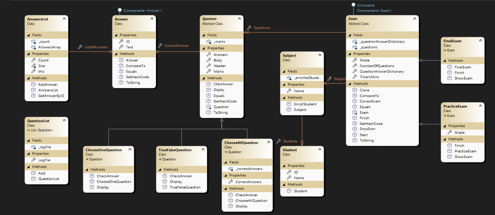
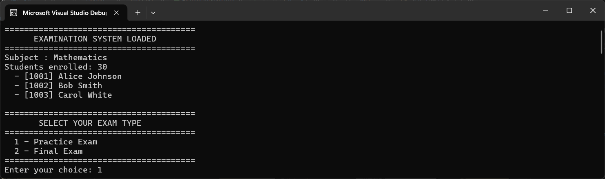
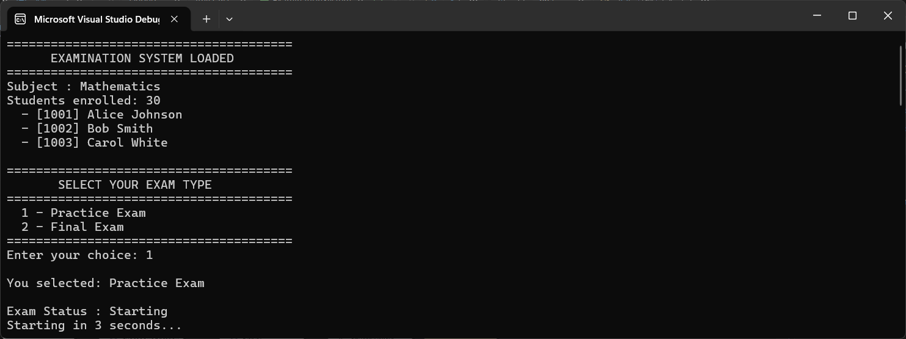
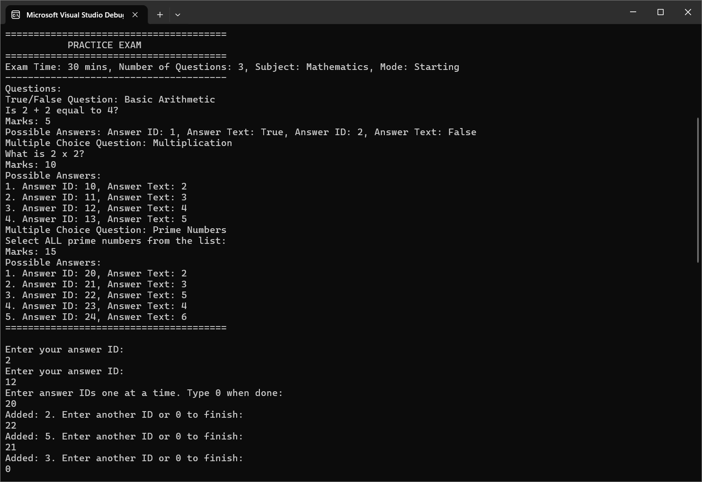
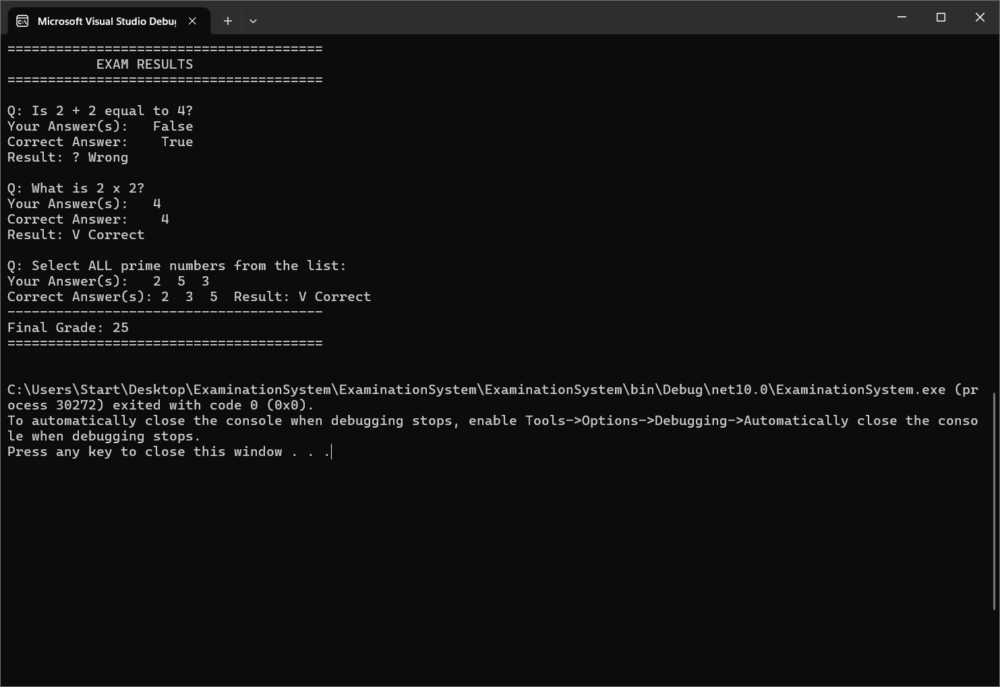

# Examination System
### Object-Oriented Programming — Design & Implementation
**C# | .NET | Console Application**

---

## Table of Contents
1. [Project Overview](#1-project-overview)
2. [Class Diagram](#2-class-diagram)
3. [OOP Concepts Applied](#3-oop-concepts-applied)
4. [Architecture & Execution Flow](#4-architecture--execution-flow)
5. [Application Screenshots](#5-application-screenshots)
6. [Key Design Decisions](#6-key-design-decisions)

---

## 1. Project Overview

The Examination System is a fully object-oriented C# console application that simulates a digital exam environment. Students can take either a **Practice Exam** or a **Final Exam**, both sharing a common exam engine while differing in how results are revealed.

The project was built from the ground up to demonstrate core and advanced OOP principles: encapsulation, inheritance, polymorphism, abstraction, interfaces, and protective programming.

---

## 2. Class Diagram


*Figure 1 — Full class diagram of the Examination System*

Key relationships visible in the diagram:

- `Answer` implements `IComparable<Answer>` for sorting
- `AnswersList` contains `Answer[]` — **composition**
- `Question` (abstract) owns `AnswersList` and `Answer` (CorrectAnswer)
- `TrueFalseQuestion`, `ChooseOneQuestion`, `ChooseAllQuestion` all extend `Question`
- `QuestionList` extends `List<Question>` — adds file logging on `Add()`
- `Exam` (abstract) implements `ICloneable` and `IComparable<Exam>`
- `Exam` owns `QuestionList`, `Subject`, and `Dictionary<Question, Answer[]>`
- `PracticeExam` and `FinalExam` both extend `Exam`
- `Subject` contains enrolled `Student[]`

---

## 3. OOP Concepts Applied

### 3.1 Encapsulation

Every class protects its internal state. Private fields are exposed only through controlled properties and methods. Mutable collections are returned as **defensive copies** so callers cannot corrupt internal state.

```csharp
// AnswersList — internal array never directly exposed
private Answer[] AnswersArray;
public Answer[] ListOfAnswers => (Answer[])AnswersArray.Clone();

// Exam — dictionary copy returned, original protected
public Dictionary<Question, Answer[]> QuestionAnswerDictionary
    => new Dictionary<Question, Answer[]>(_questionAnswerDictionary);
```

---

### 3.2 Abstraction

Both `Question` and `Exam` are **abstract classes**. They define *what* must exist without prescribing *how* it works — each subclass provides its own implementation.

| Abstract Class | Responsibility |
|---|---|
| `Question` | Forces `Display()` and `CheckAnswer()` on all question types |
| `Exam` | Forces `ShowExam()`; provides default `Start()` and `Finish()` logic |

---

### 3.3 Inheritance

The project has two clean inheritance chains:

```
Question  ──►  TrueFalseQuestion
          ──►  ChooseOneQuestion
          ──►  ChooseAllQuestion

Exam      ──►  PracticeExam
          ──►  FinalExam
```

Each derived class calls `base(...)` in its constructor to reuse shared validation logic. For example, `TrueFalseQuestion` hardcodes `answerSize = 2`:

```csharp
public TrueFalseQuestion(..., Answer? correctAnswer)
    : base(header, body, marks, correctAnswer, 2) { }
```

---

### 3.4 Polymorphism

Runtime polymorphism is demonstrated throughout. The most clear example is how `Start()` loops over a `Question[]` and calls `Display()` and `CheckAnswer()` — the correct version for each subtype is resolved automatically at runtime:

```csharp
foreach (Question q in _questions)
{
    q.Display();        // TrueFalse? ChooseOne? ChooseAll? — resolved at runtime
    q.CheckAnswer(...); // set-comparison for ChooseAllQuestion called automatically
}
```

The same applies to `Exam`: calling `selectedExam.Start()` on a base reference invokes the overridden `Finish()` of whichever subtype was selected by the user.

---

### 3.5 Interfaces

| Interface | Where Used | Purpose |
|---|---|---|
| `IComparable<Answer>` | `Answer` | Sort answers by ID — enables `OrderBy()` in `ChooseAllQuestion.CheckAnswer()` |
| `ICloneable` | `Exam` | `Clone()` produces a copy of the exam |
| `IComparable<Exam>` | `Exam` | Compare exams by `TimeInMins` first, then `NumberOfQuestions` |

```csharp
// IComparable<Exam> — two-level comparison
public int CompareTo(Exam? other)
{
    if (this.TimeInMins != other.TimeInMins)
        return this.TimeInMins.CompareTo(other.TimeInMins);
    return this.NumberOfQuestions.CompareTo(other.NumberOfQuestions);
}
```

---

### 3.6 Protective Programming

Every class validates its inputs at construction time and in property setters:

- Null strings fall back to `"corrupted Header"` / `"corrupted Body"`
- `Marks <= 0` defaults to `1`; `TimeInMins < 5` defaults to `5`
- Null `correctAnswer` throws `ArgumentNullException` immediately
- `AnswersList` throws `InvalidOperationException` when full
- Indexer throws `IndexOutOfRangeException` for out-of-range index
- `Start()` validates numeric input and **retries** until a valid answer ID is entered
- `ChooseAllQuestion` rejects duplicate selections and requires at least one answer

```csharp
// Defensive input loop — never silently skips a question
Answer? studentAnswer = null;
while (studentAnswer == null)
{
    if (!int.TryParse(Console.ReadLine(), out int inputId))
    {
        Console.WriteLine("Invalid input. Please enter a numeric ID:");
        continue;
    }
    studentAnswer = q.Answers.GetAnswerByID(inputId);
    if (studentAnswer == null)
        Console.WriteLine("Answer ID not found. Try again:");
}
```

---

### 3.7 Method Overriding

All classes override `ToString()`, `Equals()`, and `GetHashCode()` consistently:

- `Equals()` uses field-level **value comparison**
- `GetHashCode()` uses `HashCode.Combine()` with **exactly the same fields** as `Equals()` — honouring the contract that equal objects must have equal hash codes

```csharp
public override bool Equals(object? obj)
{
    if (obj is Question other)
        return Header == other.Header && Body == other.Body &&
               Marks == other.Marks && CorrectAnswer.Equals(other.CorrectAnswer);
    return false;
}

public override int GetHashCode()
    => HashCode.Combine(Header, Body, Marks, CorrectAnswer);
```

---

## 4. Architecture & Execution Flow

### 4.1 Namespace Structure

| Namespace | Classes |
|---|---|
| `ExaminationSystem.Answers` | `Answer`, `AnswersList` |
| `ExaminationSystem.Questions` | `Question`, `TrueFalseQuestion`, `ChooseOneQuestion`, `ChooseAllQuestion`, `QuestionList` |
| `ExaminationSystem.Exams` | `Exam`, `PracticeExam`, `FinalExam`, `ExamMode` |
| `ExaminationSystem` | `Student`, `Subject`, `Program` |

---

### 4.2 Execution Flow

```
1. Create Subject → enroll Students
         │
2. Build Answer objects with unique IDs
         │
3. Construct Questions (TrueFalse / ChooseOne / ChooseAll)
   └── Add to both PracticeExam and FinalExam
         │
4. User selects exam type
   ├── 1 → PracticeExam
   └── 2 → FinalExam
         │
5. Mode = Starting → Start() called
         │
6. ShowExam()
   └── Displays exam header info + all questions with choices
         │
7. Input loop (per question)
   ├── ChooseAllQuestion  → collect multiple IDs until user types 0
   │     - reject non-numeric
   │     - reject unknown IDs
   │     - reject duplicates
   │     - require at least one selection
   └── TrueFalse / ChooseOne → collect one valid ID with retry
         │
8. Finish() called
   ├── PracticeExam → CorrectExam() + show answers + correct answers + grade
   └── FinalExam    → CorrectExam() internally + show submitted answers only
```

### 4.3 Virtual vs Abstract Methods in Exam

| Method | Type | Reason |
|---|---|---|
| `ShowExam()` | `abstract` | PracticeExam and FinalExam display differently — no shared logic |
| `Start()` | `virtual` | Both exam types collect answers identically — written once in base |
| `Finish()` | `virtual` | Base sets Mode and calls CorrectExam(); subclasses add display logic via `base.Finish()` |
| `CorrectExam()` | plain | Pure calculation — no subclass should ever change how marks are counted |

---

## 5. Application Screenshots

### 5.1 System Loaded & Exam Selection

*Figure 2 — Subject loaded, students enrolled, exam type selection presented*

---

### 5.2 Exam Started

*Figure 3 — Practice Exam selected, Mode set to Starting, countdown begins*

---

### 5.3 Questions Displayed & Answers Collected

*Figure 4 — ShowExam() displays all questions; input loop collects answers per question type*

---

### 5.4 Results — Practice Exam

*Figure 5 — PracticeExam.Finish() shows student answers, correct answers, and final grade*

---

## 6. Key Design Decisions

### Why `Dictionary<Question, Answer[]>` instead of `Dictionary<Question, Answer>`?

`ChooseAllQuestion` requires the student to select **multiple answers**. Using `Answer[]` as the dictionary value unifies storage for all question types and allows `CheckAnswer(Answer[])` to be called uniformly through polymorphism — no special-casing needed outside the question classes themselves.

---

### Why is `Start()` virtual in the base class, not abstract?

Both `PracticeExam` and `FinalExam` collect answers **identically** — the full input loop, retry logic, and duplicate detection is shared. Making it `virtual` means this logic is written **once** in the base. Only `Finish()` and `ShowExam()` differ between subtypes and are overridden.

---

### Why does `QuestionList` extend `List<Question>`?

Inheriting from `List<Question>` gives full list functionality for free while allowing `Add()` to be overridden to **log every question to a text file** automatically. This demonstrates the Open/Closed principle — the list is extended without modifying the consuming code.

```csharp
public new void Add(Question question)
{
    base.Add(question);
    // automatically appends to log file
    using StreamWriter writer = new StreamWriter(LogFile, append: true);
    writer.WriteLine(question);
}
```

---

### Why does `ChooseAllQuestion.CheckAnswer()` sort before comparing?

Students may select correct answers in **any order**. Sorting both the student's selections and the correct answers before `SequenceEqual()` ensures order-independent set comparison — which is the mathematically correct definition of "select all that apply".

```csharp
public override bool CheckAnswer(Answer[]? studentAnswer)
{
    if (studentAnswer == null) return false;
    var student = studentAnswer.Select(a => a.Text).OrderBy(t => t);
    var correct = _correctAnswers.Select(a => a.Text).OrderBy(t => t);
    return student.SequenceEqual(correct);
}
```

---

> **Note:** Screenshots should be placed in a `screenshots/` folder alongside this README.
> Rename the images: `diagram.png`, `screen1.png`, `screen2.png`, `screen3.png`, `screen4.png`
